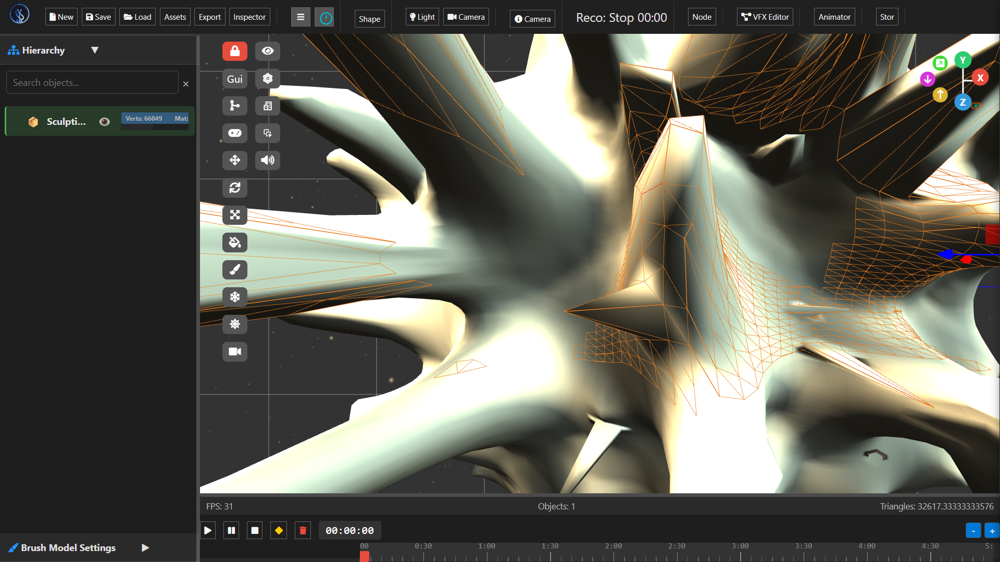
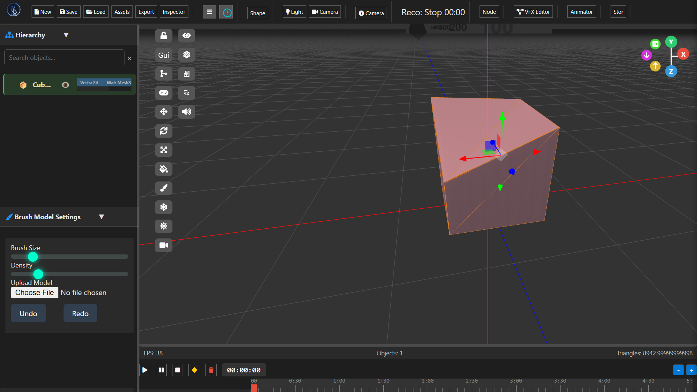
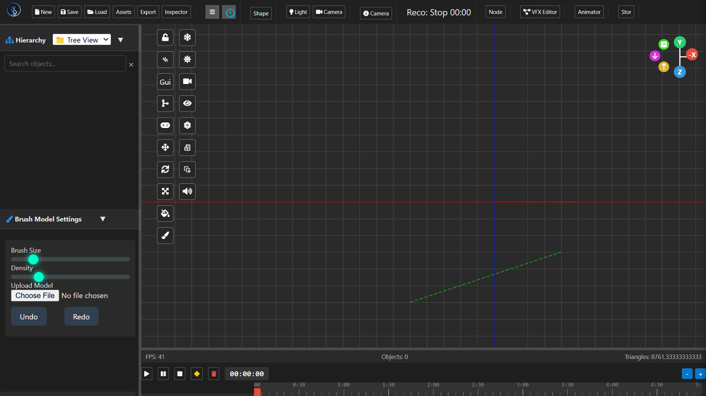
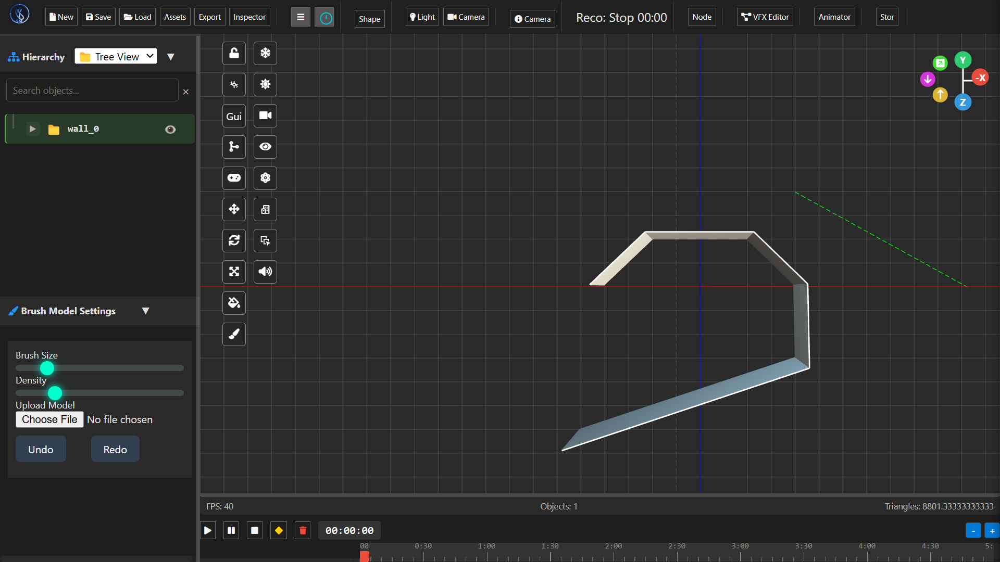
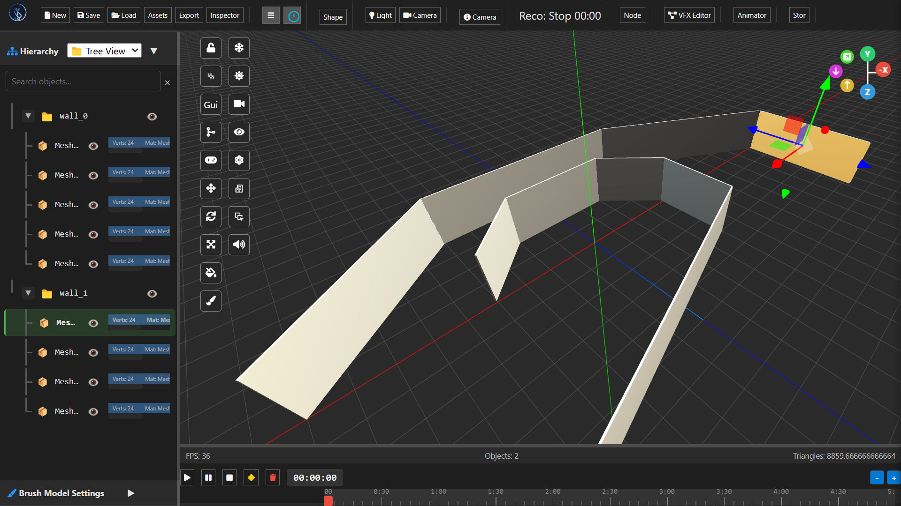
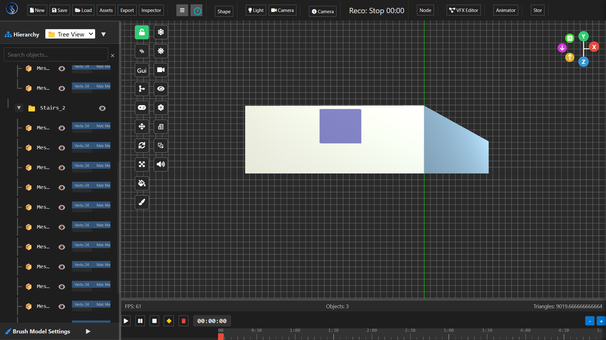

# ✨ SM-Engine: 3D Modeling & Physics Editor ✨
<style>
  /*
 * =========================================
 *  Styles for the SM-Engine Logo
 * =========================================
 */

/* 1. Main Logo Container */
/* This uses Flexbox to perfectly align the icon and text. */
.logo {
    display: flex;
    align-items: center;
    gap: 12px; /* Controls the space between the icon and text */
    color: #E0E0E0;
    font-family: -apple-system, BlinkMacSystemFont, 'Segoe UI', Roboto, Helvetica, Arial, sans-serif;
    font-weight: 600;
    font-size: 20px;
    text-decoration: none;
    cursor: pointer;
}

/* 2. SVG Icon Styling */
/* Sets the size and adds a subtle, high-performance drop shadow for depth. */
.logo__svg {
    width: 42px;
    height: 42px;
    filter: drop-shadow(0 2px 4px rgba(0, 0, 0, 0.25));
    overflow: visible; /* Ensures shadows and strokes aren't clipped */
}

/* 3. Logo Text Styling */
/* Styles for the "SM Engine" text. */
.logo__text {
    letter-spacing: 0.5px;
}

/* Styles for the "TM" trademark symbol to make it look professional. */
.logo__text-pro {
    font-size: 0.5em;
    vertical-align: super;
    margin-left: 2px;
    color: #999;
    font-weight: 400;
}

/*
 * 4. SVG Path Specific Styles
 * These classes are applied directly to the <path> elements inside the SVG.
 * They apply the gradients defined in the SVG's <defs>.
 */

/* Styles the main, outer shape of the logo */
.logo__main-path {
    fill: url(#logoMainFill);           /* Applies the dark blue gradient fill */
    stroke: url(#logoOuterStroke);      /* Applies the metallic gray border */
    stroke-width: 2;
    stroke-linejoin: round;
}

/* Styles the inner highlight path to create a 3D bevel effect */
.logo__highlight-path {
    fill: none;                         /* This path has no fill, only a stroke */
    stroke: url(#logoInnerHighlight);   /* Applies the bright blue highlight stroke */
    stroke-width: 1.5;
    stroke-linejoin: round;
    opacity: 0.8;
}
</style>
<div align="center">
<!-- The Logo's HTML Structure -->
<div class="logo">
    <svg class="logo__svg" viewBox="0 0 70 70" xmlns="http://www.w3.org/2000/svg">
        <defs>
            <!-- These gradients MUST remain inside the SVG -->
            <linearGradient id="logoMainFill" x1="0%" y1="0%" x2="100%" y2="100%">
                <stop offset="0%" stop-color="#2c3e50" />
                <stop offset="100%" stop-color="#1c2833" />
            </linearGradient>
            <linearGradient id="logoOuterStroke" x1="0%" y1="100%" x2="100%" y2="0%">
                <stop offset="0%" stop-color="#4e5b6b" />
                <stop offset="100%" stop-color="#7e8c9d" />
            </linearGradient>
            <linearGradient id="logoInnerHighlight" x1="0%" y1="0%" x2="100%" y2="100%">
                <stop offset="0%" stop-color="#66b3ff" />
                <stop offset="100%" stop-color="#89cff0" />
            </linearGradient>
        </defs>

        <!-- Apply the .logo__main-path class here -->
        <path class="logo__main-path"
              d="M10 60 L10 15 L20 10 L35 10 L45 10 L60 10 L60 55 L55 60 L35 60 L30 55 L30 35 L40 30 L40 15 L35 10 M30 35 L40 30" />
        
        <!-- Apply the .logo__highlight-path class here -->
        <path class="logo__highlight-path"
              d="M12 58 L12 16 L21 12 L35 12 L44 12 L58 12 L58 54 L54 58 L35 58 L32 54 L32 36 L39 32 L39 16" />
    </svg>
    <span class="logo__text">SM Engine<span class="logo__text-pro">TM</span></span>
</div>
</div>
 
</div>

<p align="center">
  <strong>A comprehensive and modular 3D modeling editor built with html css js and webGL, featuring node-based workflows, integrated physics simulation, and powerful brush tools.</strong>
</p>

<p align="center">
  <a href="LICENSE"></a>
  
  
  
  <a href="https://github.com/medelbou3/SM-Engine/releases"></a>
  <a href="https://github.com/medelbou3/SM-Engine/issues"></a>
</p>

---

## 📸 Visual Showcase

<div align="center">
  
  <p><em>Main interface with the powerful Node Editor panel and 3D viewport</em></p>
</div>

<div align="center">
  
  <p><em>The integrated physics engine with real-time object interactions</em></p>
</div>

<div align="center">
  
  <p><em>Brush Modeling panel with density controls and import options</em></p>
</div>

<div align="center">
  
  
  <p><em>Modeling and sculpting tools in real time</em></p>
</div>

<div align="center">
  <h2>Architecture Tools</h2>
  <h3>Wall Tools</h3>
  
  
  
  <h3>Windows and doors tools</h3>
  
  <p><em>Architecture Tools Wall to build what you need</em></p>
  
</div>

<div align="center">
  
  <p><em>Workspace overview with Scene Hierarchy and Asset Management</em></p>
</div>

<div align="center">
  
  <p><em>High-fidelity rendering in the 3D viewport</em></p>
</div>

---

## 🌟 Core Features

### 🎨 Brush Modeling Suite
- **Intuitive Sculpting Tools:** Draw, Smooth, Inflate, Flatten, Pinch, and Crease tools for precise mesh manipulation
- **Dynamic Parameters:** Adjustable brush size, strength, density and falloff for complete control
- **Reference Support:** Directly upload and use reference models as sculpting guides
- **Seamless Import:** Drag-and-drop support for base meshes via the integrated file browser

### 🔗 Visual Node Editor
- **Graphical Programming:** Design complex materials, shaders, and procedural geometry without writing code
- **Real-time Preview:** Instant visual feedback as you connect and modify nodes
- **Extensible Architecture:** Create and share custom node types with the SM-Engine community
- **Template Library:** Pre-built node graphs for common materials and effects

### ⚙️ Integrated Physics Engine
- **Multiple Simulation Environments:** Set up and switch between different physics scenarios
- **Comprehensive Dynamics:** Simulate rigid bodies, soft bodies, cloth, and fluid interactions
- **Advanced Controls:** Configure gravity, friction, restitution, and collision properties
- **Constraints System:** Create joints, hinges, springs, and mechanical linkages

### 🖼️ Advanced Viewport
- **High-Performance Rendering:**webGL powered visualization with PBR materials
- **Multiple View Modes:** Orthographic (Top, Front, Side) and Perspective cameras with customizable settings
- **Real-time Analytics:** Monitor FPS, draw calls, polygon count, and memory usage
- **Transformation Tools:** Intuitive gizmos for precise object manipulation (Translate, Rotate, Scale)

### 📂 Robust Workflow & I/O
- **Non-destructive Editing:** Comprehensive Undo/Redo system with history browser
- **Organized Scene Management:** Hierarchical scene structure with nested object support
- **Asset Management:** Dedicated panel for importing, organizing, and applying materials and models
- **File Format Support:** Import/export for industry-standard formats (.obj, .fbx, .stl, .dae, .gltf)
- **Session Recording:** Capture your workflow for tutorials or time-lapse demonstrations

---

## 🛠️ Technology Stack

SM-Engine is built on modern and reliable technologies:

## 🖥 Language
- **JavaScript (ES6+)**
  - Runs natively in the browser
  - Ideal for real-time interactive applications

## 🧱 Graphics API
- **[Three.js](https://threejs.org/)**  
  - Built on top of WebGL
  - Simplifies 3D rendering, lighting, materials, and cameras

## 🖼 GUI Framework
- **[dat.GUI](https://github.com/dataarts/dat.gui)** or **[Tweakpane](https://cocopon.github.io/tweakpane/)**
  - Lightweight GUI for real-time controls and debugging
- **Optional (Advanced UI):**
  - **[React.js](https://reactjs.org/)** or **[Vue.js](https://vuejs.org/)** for component-based UIs

## 🎮 Physics Engine
- **[Ammo.js](https://github.com/kripken/ammo.js)**
  - Port of Bullet Physics to JavaScript/WebAssembly
- **Alternative: [Cannon-es](https://github.com/pmndrs/cannon-es)**
  - Easier to use, great for games and simulations

## 🧳 Asset Processing (3D Models)
- **[Three.js Loaders](https://threejs.org/docs/#examples/en/loaders/GLTFLoader)**
  - Use `GLTFLoader`, `FBXLoader`, `OBJLoader` for importing models
- **Recommended format: GLTF/GLB**
  - Optimized for web performance
- **Tools:** Blender, glTF-Pipeline for converting and optimizing assets

## ✨ Shader System
- **Custom GLSL Shaders**
  - Use `ShaderMaterial` or `RawShaderMaterial` in Three.js
- **Hot Reloading:**
  - Implement with `fetch()` + `ShaderMaterial.needsUpdate = true`
  - Use **Vite** or **Webpack** with file watching for live shader reloading
---

## 🧩 Optional Tools for Development

### 🔧 Dev Environment
- **[Vite](https://vitejs.dev/)** or **[Parcel](https://parceljs.org/)** for bundling and fast dev server

### 🎨 Post-Processing
- Use `EffectComposer` with `ShaderPass`, `BloomPass`, etc. for advanced visual effects

### 🔍 Scene Graph Inspector
- Built-in **[Three.js Editor](https://threejs.org/editor/)** or custom developer tools

---


---

## 📐 Interface Overview

SM-Engine features a customizable, panel-based interface designed for productivity:

```plaintext
+---------------------------------------------------------------+
| Main Toolbar (File, Edit, Assets, Export, View, Help...)      |
+--------------------------+------------------------------------+
| Hierarchy / Scene        |                                    |
|   - Physics Environments |         3D Viewport                |
|   - Objects              |         (Main Work Area)           |
|   - Cameras (Ortho/Persp)|                                    |
|   - Node Graphs          |                                    |
+--------------------------+------------------------------------+
| Assets Panel /           | Inspector / Properties Panel       |
| Brush Settings /         |   - Object Transform               |
| Node Editor              |   - Component Details (Physics,    |
| (Context Dependent)      |     Materials, Scripts...)         |
|                          |   - Brush Parameters               |
+--------------------------+------------------------------------+
| Status Bar / Output (FPS, Object Count, Recording Status)     |
+---------------------------------------------------------------+
```

- **Top:** Main menu and toolbar for global actions
- **Left:** Hierarchical organization of scene elements
- **Center:** Interactive 3D viewport with customizable display settings
- **Right:** Properties and settings for selected objects or tools
- **Bottom:** Real-time performance metrics and application status

---

## 🚀 Quick Start Guide

Get up and running with SM-Engine in just a few steps:

1. **Launch the Editor:**
   - Run `SM-Engine.exe` after installation

2. **Create a New Project:**
   - Select `File > New Project` or use the startup screen
   - Choose a template or start with an empty scene

3. **Add Elements:**
   - Create primitives via `Create > Primitive` in the main menu
   - Import models using `File > Import` or drag files into the viewport
   - Set up a physics environment through the Physics menu

4. **Sculpt & Model:**
   - Select the Brush tool from the toolbar
   - Adjust brush settings in the Context Panel
   - Left-click and drag on meshes to sculpt

5. **Create Materials:**
   - Open the Node Editor from the Context Panel
   - Create a new material graph
   - Connect nodes to build your material
   - Apply to objects via drag-and-drop

6. **Set Up Physics:**
   - Select an object and enable physics in the Inspector
   - Adjust mass, friction, and other properties
   - Click the Play button to start simulation

7. **Navigation Controls:**
   - Orbit: Alt + Left Mouse Button
   - Pan: Alt + Middle Mouse Button
   - Zoom: Mouse Wheel or Alt + Right Mouse Button
   - Focus on object: F key (with object selected)

---

## 🔧 System Requirements

| Component | Minimum | Recommended |
|-----------|---------|-------------|
| OS | Windows 10 (64-bit) | Windows 11 or Windows 10 (latest) |
| Processor | Intel Core i5 / AMD Ryzen 5 | Intel Core i7 / AMD Ryzen 7 or better |
| Memory | 8 GB RAM | 16 GB RAM or more |
| Graphics | DirectX 11 / OpenGL 4.0 GPU | NVIDIA GTX 1660 / AMD RX 5600 or better |
| VRAM | 2 GB | 6 GB or more |
| Storage | 2 GB available space | 5 GB on SSD |
| Display | 1920×1080 resolution | 2560×1440 or higher |
| Input | Keyboard and mouse | + Graphics tablet for sculpting |
| Software | .NET Framework 4.8 | .NET Framework 4.8 |

---

## 💾 Installation & Running

### Option 1: Using the Installer (Recommended)

1. Download the latest installer from the [Releases Page](https://github.com/medelbou3/SM-Engine/releases)
2. Run the `SM-Engine-Setup.exe` file
3. Follow the installation wizard instructions
4. Launch SM-Engine from the desktop shortcut or Start menu

### Option 2: Portable Version

1. Download the portable .zip file from the [Releases Page](https://github.com/medelbou3/SM-Engine/releases)
2. Extract all contents to a folder of your choice
3. Run `SM-Engine.exe` from the extracted folder
4. Note: .NET Framework 4.8 must be installed on your system

### Option 3: Building from Source

1. **Clone the Repository:**
   ```bash
   git clone https://github.com/medelbou3/SM-Engine.git
   cd SM-Engine
   ```

2. **Prerequisites:**
   - Visual Studio 2022 with ".NET desktop development" workload
   - .NET Framework 4.8 SDK
   - OpenTK NuGet package (automatically restored)
   - BulletSharp NuGet package (automatically restored)

3. **Build the Project:**
   - Open `SM-Engine.sln` in Visual Studio
   - Select Build > Build Solution (or press Ctrl+Shift+B)
   - Select the desired configuration (Debug/Release)

4. **Run the Editor:**
   - Press F5 in Visual Studio to run with debugging
   - Or navigate to `bin/Release` and run `SM-Engine.exe`

---

## 🤝 Contributing

We welcome contributions to SM-Engine! Here's how you can help:

1. **Report Issues:** Found a bug or have a suggestion? Open an issue on our [Issue Tracker](https://github.com/medelbou3/SM-Engine/issues)

2. **Contribute Code:**
   - Fork the repository
   - Create a feature branch (`git checkout -b feature/amazing-feature`)
   - Commit your changes (`git commit -m 'Add: Implement amazing feature'`)
   - Push to your branch (`git push origin feature/amazing-feature`)
   - Open a Pull Request

3. **Documentation:** Help improve our docs, tutorials, or this README

4. **Testing:** Try new features and provide feedback

See [CONTRIBUTING.md](CONTRIBUTING.md) for detailed contribution guidelines.

---

## 🛣️ Roadmap

Our development roadmap for upcoming versions:

### Short-term (v1.x)
- Advanced material node library expansion
- Texture painting and UV editing tools
- Animation keyframing system
- Improved documentation and tutorials

### Mid-term (v2.x)
- Scripting support via C# API
- Plugin architecture for extensibility
- Terrain generation and editing tools
- Advanced rendering features (volumetrics, GI)

### Long-term (v3.x)
- Real-time collaboration features
- Virtual reality sculpting mode
- AI-assisted modeling tools
- Mobile companion app

---

## 📜 License

SM-Engine is distributed under the MIT License. See the [LICENSE](LICENSE) file for full details.

---

## 🙏 Acknowledgements

- [OpenTK](https://opentk.net/) for the OpenGL wrapper
- [BulletSharp](https://github.com/AndresTraks/BulletSharp) for physics simulation
- [Assimp.Net](https://bitbucket.org/Starnick/assimpnet) for 3D model importing
- [Icons8](https://icons8.com/) for UI icons
- All our contributors and community members

---

<p align="center">
  <a href="https://github.com/medelbou3/SM-Engine">GitHub</a> •
  <a href="https://github.com/medelbou3/SM-Engine/wiki">Documentation</a> •
  <a href="https://github.com/medelbou3/SM-Engine/discussions">Community</a> •
  <a href="https://github.com/medelbou3/SM-Engine/issues">Issues</a>
</p>
