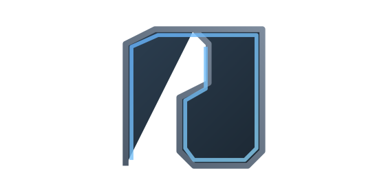
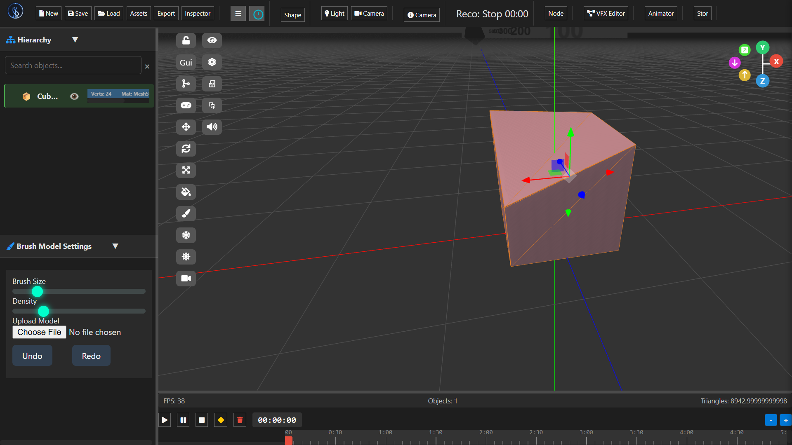
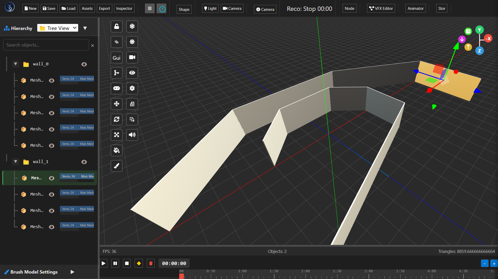
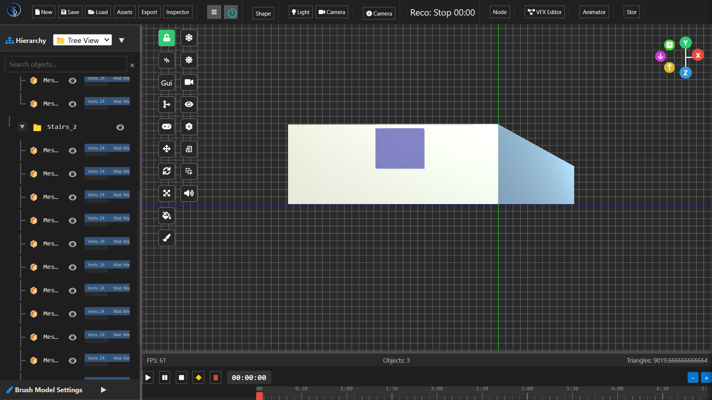

# ✨ SM-Engine: 3D Modeling & Physics Editor ✨
# ✨ SM-Engine: Advanced Web 3D Modeling & Game Editor ✨

<div class="logo" style="transform: scale(2); transform-origin: left center;">
    
    <span class="logo__text">SM Engine<span class="logo__text-pro">TM</span></span>
<div align="center">
  
  <br />
  <h1>SM Engine<span style="font-size: 0.5em; vertical-align: super;">TM</span></h1>
</div>

<p align="center">
  <strong>A comprehensive and modular 3D modeling editor built with html css js and webGL, featuring node-based workflows, integrated physics simulation, and powerful brush tools.</strong>
  <strong>A professional-grade, modular 3D Modeling and Game Development Suite.</strong><br />
  Built with Three.js, Electron, and WebAssembly, featuring high-performance sculpting, node-based visual scripting, and advanced character animation systems.
</p>

<p align="center">
  <a href="LICENSE"></a>
  
  
  
  <a href="https://github.com/medelbou3/SM-Engine/releases"></a>
  
  
  <a href="https://github.com/MEDELBOU3/SM-Engine/releases"></a>
  <a href="https://github.com/medelbou3/SM-Engine/issues"></a>
</p>

---

<h2 align="center">📺 Video Tutorial</h2>
<h2 align="center">🎬 Official Trailer & Tutorial</h2>

<p align="center">
  <a href="https://youtu.be/EY7ggEMSEGI" target="_blank">
    
    
  </a>
</p>

---

## ️ Visual Showcase

<div align="center">
  
  <p><em>The primary SM Engine environment featuring the Scene Hierarchy, integrated Asset Browser, and high-fidelity 3D Viewport.</em></p>
</div>

### 🌋 Modeling & Sculpting
<div align="center">
  
  
  <p><em>Advanced mesh manipulation: from precise vertex-level modeling to organic WASM-powered sculpting brushes.</em></p>
</div>

### 🏗️ Architectural Engineering
<div align="center">
  
  
  <p><em>Rapid environment prototyping with path-based wall generation and dynamic architectural component placement.</em></p>
</div>

### 🧬 Technical Systems
<div align="center">
  
  
  <p><em>Unified technical workflows: VS-style Code Editor for logic and the MetaSound Graph for procedural audio design.</em></p>
</div>

### ⚙️ Physics & Dynamics
<div align="center">
  
  <p><em>Real-time rigid body dynamics and collision physics powered by Rapier3D.</em></p>
</div>

---

## 🌟 Core Features

### 🎨 Brush Modeling Suite
- **Intuitive Sculpting Tools:** Draw, Smooth, Inflate, Flatten, Pinch, and Crease tools for precise mesh manipulation
- **Dynamic Parameters:** Adjustable brush size, strength, density and falloff for complete control
- **Reference Support:** Directly upload and use reference models as sculpting guides
- **Seamless Import:** Drag-and-drop support for base meshes via the integrated file browser
### 🎨 High-Performance Modeling
- **WASM Sculpting:** High-speed organic mesh manipulation powered by C++ WebAssembly.
- **Precision Modeling:** Vertex, Edge, and Face level editing with industry-standard transform gizmos.
- **Pro Brushes:** ZBrush-style toolkit including Clay, Inflate, Smooth, and Pinch with adjustable falloff.

### 🔗 Visual Node Editor
- **Graphical Programming:** Design complex materials, shaders, and procedural geometry without writing code
- **Real-time Preview:** Instant visual feedback as you connect and modify nodes
- **Extensible Architecture:** Create and share custom node types with the SM-Engine community
- **Template Library:** Pre-built node graphs for common materials and effects
### 🔗 Visual Programming
- **Multi-Graph Editor:** Design player logic, material shaders, and VFX systems using a unified node-based interface.
- **Live Preview:** Instant feedback on logic and shader changes without recompilation.

### ⚙️ Integrated Physics Engine
- **Multiple Simulation Environments:** Set up and switch between different physics scenarios
- **Comprehensive Dynamics:** Simulate rigid bodies, soft bodies, cloth, and fluid interactions
- **Advanced Controls:** Configure gravity, friction, restitution, and collision properties
- **Constraints System:** Create joints, hinges, springs, and mechanical linkages
### 🏗️ Architectural Toolkit
- **Dynamic Walls:** Draw paths to generate walls with custom height and thickness.
- **Smart Components:** Drag-and-drop windows, doors, and stairs that align to paths.

### 🖼️ Advanced Viewport
- **High-Performance Rendering:**webGL powered visualization with PBR materials
- **Multiple View Modes:** Orthographic (Top, Front, Side) and Perspective cameras with customizable settings
- **Real-time Analytics:** Monitor FPS, draw calls, polygon count, and memory usage
- **Transformation Tools:** Intuitive gizmos for precise object manipulation (Translate, Rotate, Scale)

### 📂 Robust Workflow & I/O
- **Non-destructive Editing:** Comprehensive Undo/Redo system with history browser
- **Organized Scene Management:** Hierarchical scene structure with nested object support
- **Asset Management:** Dedicated panel for importing, organizing, and applying materials and models
- **File Format Support:** Import/export for industry-standard formats (.obj, .fbx, .stl, .dae, .gltf)
- **Session Recording:** Capture your workflow for tutorials or time-lapse demonstrations
### ⚙️ Physics & Animation
- **Dual Engine Physics:** Native support for Rapier3D (WASM) and Cannon-es simulations.
- **Motion Matching:** Next-gen character animation system (UAL2) for fluid, natural movement.

---

## 🛠️ Technology Stack

SM-Engine is built on modern and reliable technologies:

## 🖥 Language
- **JavaScript (ES6+)**
  - Runs natively in the browser
  - Ideal for real-time interactive applications

## 🧱 Graphics API
- **Three.js**  
  - Built on top of WebGL
  - Simplifies 3D rendering, lighting, materials, and cameras

## 🖼 GUI Framework
- **dat.GUI** or **Tweakpane**
  - Lightweight GUI for real-time controls and debugging
- **Optional (Advanced UI):**
  - **React.js** or **Vue.js** for component-based UIs

## 🎮 Physics Engine
- **Ammo.js**
  - Port of Bullet Physics to JavaScript/WebAssembly
- **Alternative: Cannon-es**
  - Easier to use, great for games and simulations

## 🧳 Asset Processing (3D Models)
- **Three.js Loaders**
  - Use `GLTFLoader`, `FBXLoader`, `OBJLoader` for importing models
- **Recommended format: GLTF/GLB**
  - Optimized for web performance
- **Tools:** Blender, glTF-Pipeline for converting and optimizing assets

## ✨ Shader System
- **Custom GLSL Shaders**
  - Use `ShaderMaterial` or `RawShaderMaterial` in Three.js
- **Hot Reloading:**
  - Implement with `fetch()` + `ShaderMaterial.needsUpdate = true`
  - Use **Vite** or **Webpack** with file watching for live shader reloading
----

## 🧩 Optional Tools for Development

### 🔧 Dev Environment
- **Vite** or **Parcel** for bundling and fast dev server

### 🎨 Post-Processing
- Use `EffectComposer` with `ShaderPass`, `BloomPass`, etc. for advanced visual effects

### 🔍 Scene Graph Inspector
- Built-in **Three.js Editor** or custom developer tools

----


----

## 📐 Interface Overview

SM-Engine features a customizable, panel-based interface designed for productivity:

```plaintext
+---------------------------------------------------------------+
| Main Toolbar (File, Edit, Assets, Export, View, Help...)      |
+--------------------------+------------------------------------+
| Hierarchy / Scene        |                                    |
|   - Physics Environments |         3D Viewport                |
|   - Objects              |         (Main Work Area)           |
|   - Cameras (Ortho/Persp)|                                    |
|   - Node Graphs          |                                    |
+--------------------------+------------------------------------+
| Assets Panel /           | Inspector / Properties Panel       |
| Brush Settings /         |   - Object Transform               |
| Node Editor              |   - Component Details (Physics,    |
| (Context Dependent)      |     Materials, Scripts...)         |
|                          |   - Brush Parameters               |
+--------------------------+------------------------------------+
| Status Bar / Output (FPS, Object Count, Recording Status)     |
+---------------------------------------------------------------+
```

- **Top:** Main menu and toolbar for global actions
- **Left:** Hierarchical organization of scene elements
- **Center:** Interactive 3D viewport with customizable display settings
- **Right:** Properties and settings for selected objects or tools
- **Bottom:** Real-time performance metrics and application status

----

## 🚀 Quick Start Guide

Get up and running with SM-Engine in just a few steps:

1. **Launch the Editor:**
   - Run `SM-Engine.exe` after installation

2. **Create a New Project:**
   - Select `File > New Project` or use the startup screen
   - Choose a template or start with an empty scene

3. **Add Elements:**
   - Create primitives via `Create > Primitive` in the main menu
   - Import models using `File > Import` or drag files into the viewport
   - Set up a physics environment through the Physics menu

4. **Sculpt & Model:**
   - Select the Brush tool from the toolbar
   - Adjust brush settings in the Context Panel
   - Left-click and drag on meshes to sculpt

5. **Create Materials:**
   - Open the Node Editor from the Context Panel
   - Create a new material graph
   - Connect nodes to build your material
   - Apply to objects via drag-and-drop

6. **Set Up Physics:**
   - Select an object and enable physics in the Inspector
   - Adjust mass, friction, and other properties
   - Click the Play button to start simulation

7. **Navigation Controls:**
   - Orbit: Alt + Left Mouse Button
   - Pan: Alt + Middle Mouse Button
   - Zoom: Mouse Wheel or Alt + Right Mouse Button
   - Focus on object: F key (with object selected)

----

## 🔧 System Requirements

| Component | Minimum | Recommended |
|-----------|---------|-------------|
| OS | Windows 10 (64-bit) | Windows 11 or Windows 10 (latest) |
| Processor | Intel Core i5 / AMD Ryzen 5 | Intel Core i7 / AMD Ryzen 7 or better |
| Memory | 8 GB RAM | 16 GB RAM or more |
| Graphics | DirectX 11 / OpenGL 4.0 GPU | NVIDIA GTX 1660 / AMD RX 5600 or better |
| VRAM | 2 GB | 6 GB or more |
| Storage | 2 GB available space | 5 GB on SSD |
| Display | 1920×1080 resolution | 2560×1440 or higher |
| Input | Keyboard and mouse | + Graphics tablet for sculpting |
| Software | .NET Framework 4.8 | .NET Framework 4.8 |

----

## 💾 Installation & Running

### Option 1: Using the Installer (Recommended)

1. Download the latest installer from the Releases Page
2. Run the `SM-Engine-Setup.exe` file
3. Follow the installation wizard instructions
4. Launch SM-Engine from the desktop shortcut or Start menu

### Option 2: Portable Version

1. Download the portable .zip file from the Releases Page
2. Extract all contents to a folder of your choice
3. Run `SM-Engine.exe` from the extracted folder
4. Note: .NET Framework 4.8 must be installed on your system

### Option 3: Building from Source

1. **Clone the Repository:**
   ```bash
   git clone https://github.com/medelbou3/SM-Engine.git
   cd SM-Engine
   ```

2. **Prerequisites:**
   - Visual Studio 2022 with ".NET desktop development" workload
   - .NET Framework 4.8 SDK
   - OpenTK NuGet package (automatically restored)
   - BulletSharp NuGet package (automatically restored)

3. **Build the Project:**
   - Open `SM-Engine.sln` in Studio
   - Select Build > Build Solution (or press Ctrl+Shift+B)
   - Select the desired configuration (Debug/Release)

4. **Run the Editor:**
   - Press F5 in Visual Studio to run with debugging
   - Or navigate to `bin/Release` and run `SM-Engine.exe`

----

## 🤝 Contributing

We welcome contributions to SM-Engine! Here's how you can help:

1. **Report Issues:** Found a bug or have a suggestion? Open an issue on our Issue Tracker

2. **Contribute Code:**
   - Fork the repository
   - Create a feature branch (`git checkout -b feature/amazing-feature`)
   - Commit your changes (`git commit -m 'Add: Implement amazing feature'`)
   - Push to your branch (`git push origin feature/amazing-feature`)
   - Open a Pull Request

3. **Documentation:** Help improve our docs, tutorials, or this README

4. **Testing:** Try new features and provide feedback

See CONTRIBUTING.md for detailed contribution guidelines.

----

## 🛣️ Roadmap

Our development roadmap for upcoming versions:

### Short-term (v1.x)
- Advanced material node library expansion
- Texture painting and UV editing tools
- Animation keyframing system
- Improved documentation and tutorials

### Mid-term (v2.x)
- Scripting support via C# API
- Plugin architecture for extensibility
- Terrain generation and editing tools
- Advanced rendering features (volumetrics, GI)

### Long-term (v3.x)
- Real-time collaboration features
- Virtual reality sculpting mode
- AI-assisted modeling tools
- Mobile companion app

----

## 📜 License

SM-Engine is distributed under the MIT License. See the LICENSE file for full details.

----

## 🙏 Acknowledgements

- OpenTK for the OpenGL wrapper
- BulletSharp for physics simulation
- Assimp.Net for 3D model importing
- Icons8 for UI icons
- All our contributors and community members
| Layer | Technologies |
| :--- | :--- |
| **Core** | JavaScript (ES6+), C++ (WebAssembly) |
| **Runtime** | Electron (Native Windows Desktop) |
| **Graphics** | Three.js (WebGL 2.0 / WebGPU Ready) |
| **Physics** | Rapier3D, Cannon-es |
| **UI Engine** | Golden Layout, CodeMirror 6 |

---

## 💾 Installation & Development

### Standard User
1. Download the latest `SM-Engine.Setup.exe` from Releases.
2. Run the installer and launch from your desktop.

### For Developers
1. **Clone:** `git clone https://github.com/MEDELBOU3/SM-Engine.git`
2. **Install:** `npm install`
3. **Start:** `npm start`

---

## 📜 License
SM-Engine is distributed under the MIT License. See the LICENSE file for full details.

<p align="center">
  <a href="https://github.com/medelbou3/SM-Engine">GitHub</a> •
  <a href="https://github.com/medelbou3/SM-Engine/wiki">Documentation</a> •
  <a href="https://github.com/medelbou3/SM-Engine/discussions">Community</a> •
  <a href="https://github.com/medelbou3/SM-Engine/issues">Issues</a>
  <a href="https://github.com/MEDELBOU3/SM-Engine">GitHub</a> •
  <a href="https://github.com/MEDELBOU3/SM-Engine/wiki">Documentation</a> •
  <a href="https://github.com/MEDELBOU3/SM-Engine/discussions">Community</a> •
  <a href="https://github.com/MEDELBOU3/SM-Engine/issues">Issues</a>
</p>
