# SM Engine

<div align="center">


### Modular real-time 3D creation, game development, animation, virtual production, and runtime tooling

**Three.js · Electron · JavaScript · WebAssembly · WebGL**

[](LICENSE)


[](https://github.com/MEDELBOU3/SM-Engine/releases)
[](https://github.com/MEDELBOU3/SM-Engine/issues)

</div>

---

## Overview

**SM Engine** is a desktop editor and runtime platform for building interactive 3D scenes, games, animation, cinematic content, and real-time media workflows.

The project combines a Three.js-based renderer with a modular editor architecture, gameplay runtime, character/player systems, animation tooling, terrain and environment tools, node-based workflows, virtual-production capture, build/export pipelines, and a package-style plugin system.

The long-term goal is not to imitate one existing DCC or game engine feature-for-feature, but to provide a coherent creation environment where modeling, animation, runtime systems, scripting, media production, and export share the same scene and project architecture.

> **Project status:** SM Engine is under active development. Core systems are usable, while some advanced subsystems are still experimental or being refactored. APIs and editor layouts may change between development builds.

---

## Official Trailer & Tutorial

<div align="center">

<a href="https://youtu.be/EY7ggEMSEGI">
  
</a>

</div>

---

## Highlights

| Area | Current capabilities |
|---|---|
| **Editor** | Multi-workspace desktop editor, hierarchy, inspector, viewport, timeline, graph tools, assets, history, console and spreadsheet views |
| **3D Modeling** | Primitive creation, transform tools, mesh operations, modifiers, UV workflows and advanced modeling utilities |
| **Sculpting** | Brush-based mesh sculpting with configurable size, strength, hardness, falloff and specialized terrain/mesh tools |
| **Rendering** | Three.js/WebGL rendering, PBR materials, ACES tone mapping, post-processing and experimental hybrid global illumination |
| **Animation** | Timeline, keyframes, graph editing, rig/bone workflows, animation clips, state-machine tooling and 2D animation |
| **Gameplay Runtime** | Runtime lifecycle, gameplay tags/events, teams, physics components, AI, animation runtime, audio/UI bridges and save-game systems |
| **Player / Character** | Modular character, input, movement, grounding, physics, camera, animation loading/controller and motion-matching pipeline |
| **Environment** | Terrain sculpting, vegetation, water, game-development environment tools, atmosphere and lighting |
| **2D Animation** | Drawing workspace, layers, brushes, onion skinning, camera controls, storyboard hooks and shared timeline context |
| **Virtual Production** | Webcam, capture-card and phone-camera input, USB/remote capture paths, recording and camera/tracking infrastructure |
| **Build & Export** | Build validation/cooking, Web export, standalone runtime packaging and Electron desktop-project export |
| **Plugins** | Manifest-based packages with dependencies, lifecycle hooks and runtime/editor contributions |
| **Performance** | Dynamic resolution, adaptive LOD, visibility/occlusion, geometry/shadow/memory budgets, instancing and performance monitoring |

---

## Visual Showcase

<div align="center">
  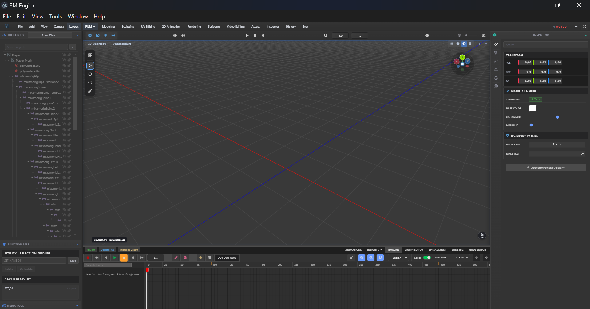
  <p><em>Main editor workspace with scene tools, viewport, hierarchy, inspector and animation editing.</em></p>
</div>

<div align="center">
  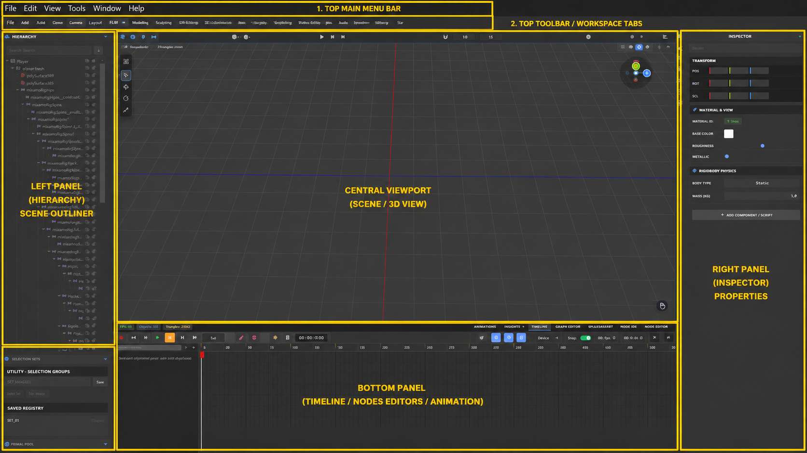
</div>

### Nodes & Animation

<div align="center">
  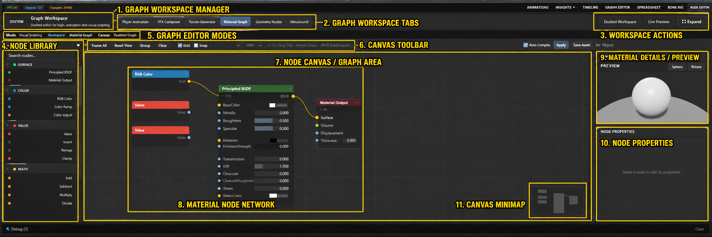
  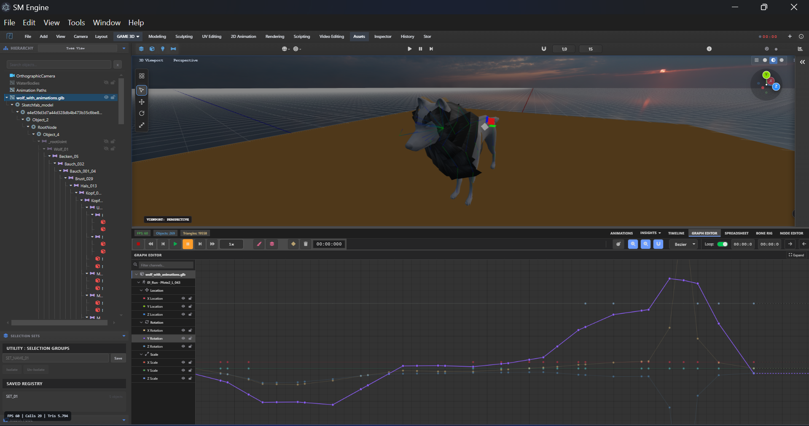
  <p><em>Node-based editing and animation curve workflows.</em></p>
</div>

### Modeling & Sculpting

<div align="center">
  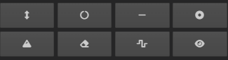
  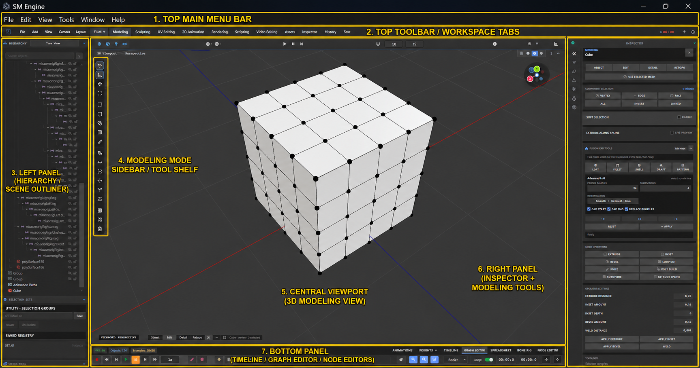
  <p><em>Brush sculpting and polygonal modeling tools.</em></p>
</div>

### Materials, Lighting & Environment

<div align="center">
  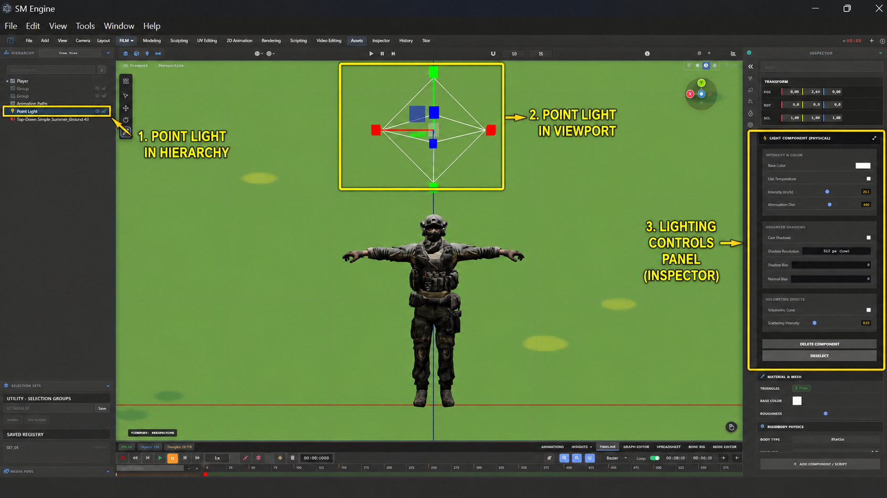
  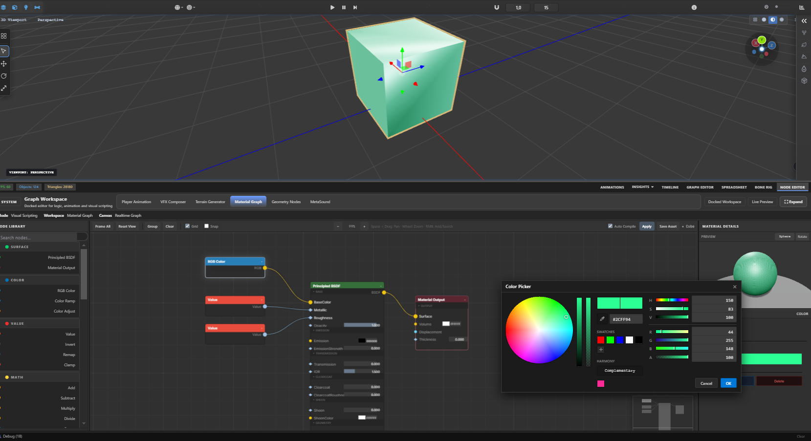
</div>

<div align="center">
  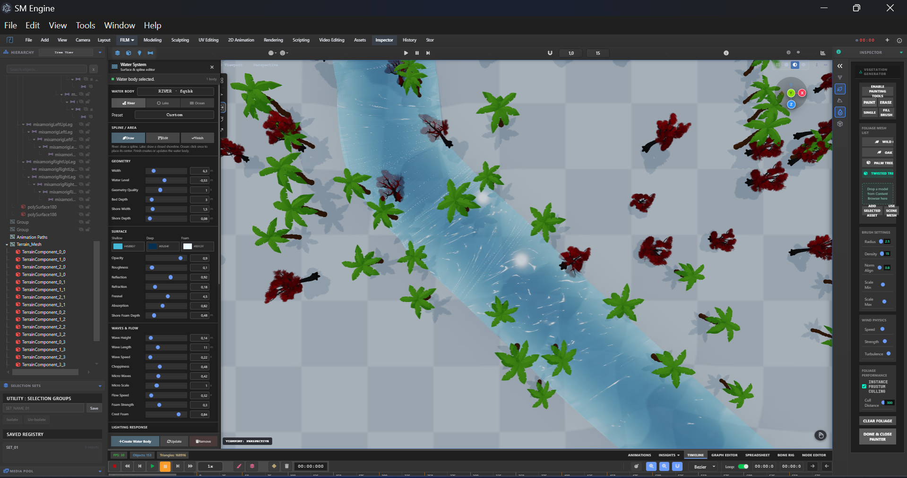
  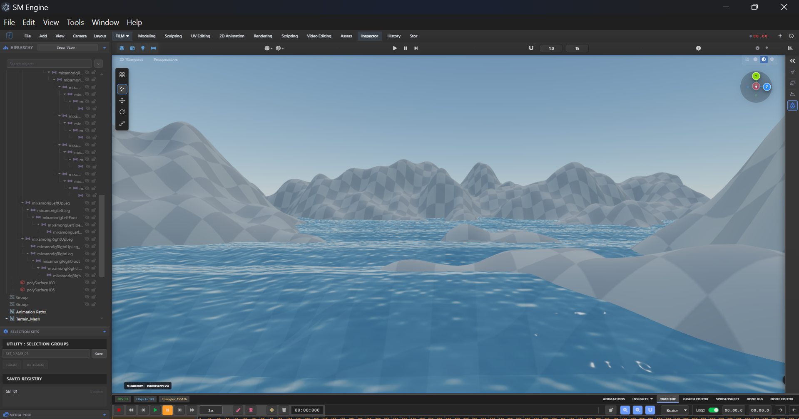
  <p><em>Terrain, atmosphere, materials, lighting and water systems.</em></p>
</div>

### Media & 2D Animation

<div align="center">
  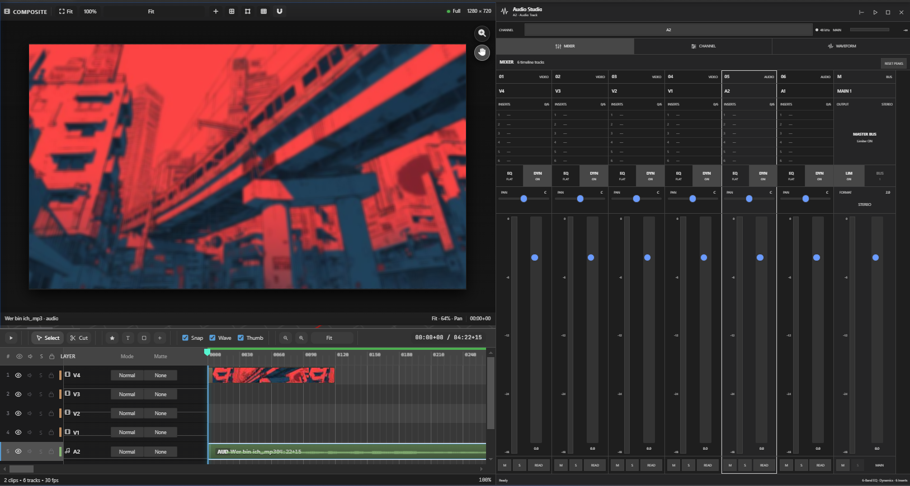
  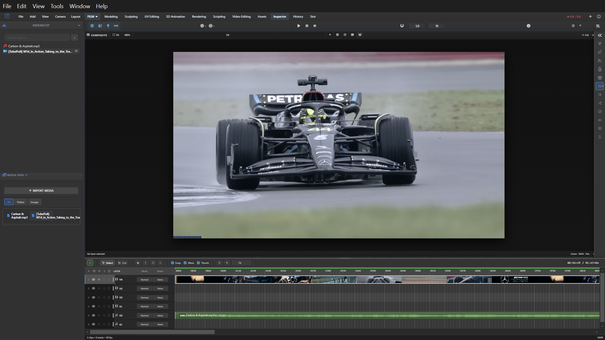
</div>

<div align="center">
  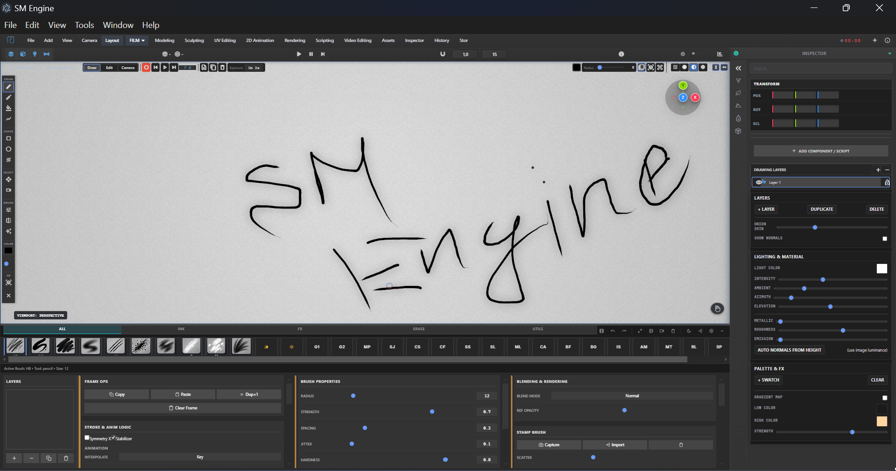
  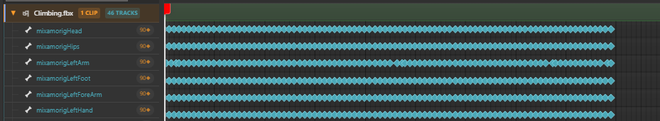
  <p><em>Media editing, 2D drawing, animation layers and keyframe workflows.</em></p>
</div>

---

## Editor Workspaces

SM Engine is organized around task-focused workspaces rather than one permanently overloaded interface.

Current editor modes and workspace surfaces include:

- **Film / Content**
- **Game Development**
- **Terrain**
- **Modeling**
- **Sculpting**
- **UV Editing**
- **2D Animation**
- **Rendering**
- **Scripting**
- **Video Editing**
- **Assets**
- **Inspector**
- **History**
- **Stor**
- **Live Capture**

Each workspace is responsible for its own UI lifecycle so tools can appear only when relevant and the central viewport remains the primary working surface.

---

## Editor Architecture

```text
SM Engine Editor
│
├── Main Menu / Workspace Bar
│
├── Left Region
│   ├── Hierarchy / Scene Outliner
│   ├── Selection Sets
│   ├── Storyboard / Media panels
│   └── Context-specific utilities
│
├── Center Region
│   ├── 3D Viewport
│   ├── 2D Drawing Overlay
│   ├── Transform / camera controls
│   └── Workspace-specific tool shelves
│
├── Right Region
│   ├── Inspector
│   ├── Object / component properties
│   ├── Materials
│   ├── Tool settings
│   └── Context-specific editors
│
└── Bottom Region
    └── Shared Animation Editor
        ├── Timeline
        ├── Dope Sheet
        ├── Graph Editor
        ├── Nodes / Rig tools
        ├── Spreadsheet
        └── Console
```

The animation editor is designed as a **shared timeline surface**. Different workflows change its context instead of creating multiple competing timeline implementations.

---

## Core Systems

### 1. Modeling & Sculpting

SM Engine includes interactive mesh-editing and sculpting workflows intended for both scene construction and asset iteration.

**Modeling**
- Primitive and mesh creation
- Translate / rotate / scale gizmos
- Advanced modeling utilities
- Modifier-oriented workflows
- UV editing tools
- Spline and path-oriented modeling features
- Scene-aware hierarchy integration

**Sculpting**
- Draw
- Smooth
- Inflate
- Flatten
- Pinch
- Crease
- Configurable brush size, strength, hardness and falloff
- Mesh and terrain-specific sculpting paths
- History integration for undo/redo

---

### 2. Rendering & Lighting

The renderer is based on **Three.js/WebGL** and uses physically based materials and modern color management.

Current rendering infrastructure includes:

- PBR materials
- ACES filmic tone mapping
- sRGB output
- HDR / EXR environment loading
- Shadow systems
- Post-processing
- Bloom and screen-space effects
- Lighting and atmosphere tools
- Performance-aware rendering budgets

#### Experimental Hybrid GI

SM Engine also contains an experimental global-illumination subsystem under `engine/lighting/lumen/`.

The current architecture includes concepts such as:

```text
GBuffer
Screen-Space GI
Radiance Probe Grid
Radiance Cache
Emissive Injection
Probe Texture Atlas
Probe Tracing
Surface Cache
Voxel Scene Foundation
Indirect Diffuse Pass
Frame Scheduler
```

This system is **experimental** and should not be interpreted as feature-equivalent to Unreal Engine's Lumen implementation.

---

### 3. Performance & Scene Scaling

The engine contains dedicated performance-management systems rather than relying only on raw renderer settings.

```text
PerformanceMonitor
GeometryBudgetManager
VisibilityManager
OcclusionManager
AdaptiveLODManager
MeshClusterManager
InstanceManager
DynamicResolutionManager
ShadowBudgetManager
MemoryBudgetManager
PerformanceManager
EngineSentinel
```

These systems are intended to cooperate so scene quality can adapt to frame time, geometry complexity, visibility and memory pressure.

---

### 4. Animation

SM Engine uses a shared animation editing pipeline across 3D and 2D workflows.

Features include:

- Timeline and playhead
- Keyframe creation and deletion
- Dope-sheet editing
- Graph/curve editing
- Animation tracks and channels
- Bone/rig workflows
- Animation clip loading
- Animation state-machine editor infrastructure
- Spreadsheet and console integration
- Context switching between 3D and 2D animation

The shared Timeline can expose a dedicated 2D context while keeping the same underlying editor:

```text
3D Context
Dope Sheet · Curves · Nodes · Rig · Spreadsheet · Console

2D Context
Drawing Dope Sheet · Frames · Curves · Storyboard
```

---

### 5. 2D Animation

The 2D animation system is designed as a dedicated workspace layered over the existing editor rather than as a separate application.

Current capabilities include:

- Draw / Edit / Camera workflow
- Brush presets and compact brush shelf
- Drawing layers
- Onion skinning
- Radius, strength, opacity, spacing, hardness and stabilization controls
- 2D camera controls and camera keyframes
- Storyboard integration
- Anime/color production hooks
- 2D + 3D underlay workflow
- Shared timeline integration
- Frame copy / paste / duplicate / clear operations

The UI is actively being refactored toward stricter workspace isolation and a cleaner Blender-style editor layout.

---

### 6. Player & Character Framework

The player framework is intentionally modular.

```text
engine/player/
├── config/
│   ├── PlayerConfig
│   └── PlayerAnimationManifest
├── core/
│   ├── PlayerState
│   └── PlayerCharacter
├── input/
│   └── PlayerInputController
├── movement/
│   ├── PlayerRotationController
│   ├── PlayerMovementController
│   └── PlayerGrounding
├── physics/
│   └── PlayerPhysicsController
├── camera/
│   └── PlayerCameraController
├── animation/
│   ├── PlayerAnimationLoader
│   ├── PlayerAnimationClipRegistry
│   ├── PlayerAnimationLoaderIntegration
│   └── PlayerAnimationController
└── motion-matching/
    ├── PlayerMotionMatchingDatabase
    ├── PlayerTraversalDetector
    ├── PlayerTraversalAnalyzer
    ├── PlayerTraversalAnimationSelector
    ├── PlayerMotionWarper
    └── PlayerMotionMatchingSystem
```

The goal is to keep input, movement, physics, camera and animation replaceable instead of coupling them into one monolithic player script.

---

### 7. Gameplay Runtime

The standalone runtime is organized as independent systems connected through runtime bridges.

#### Physics components

- Collider component
- Rigid-body component
- Character-body component
- Trigger-volume component
- Physics bridge

#### Gameplay framework

- Gameplay tags
- Gameplay events
- Event manager
- Team manager
- Gameplay runtime bridge

#### AI

- Blackboard
- Behavior tree
- Navigation agent
- AI controller
- AI pawn component
- AI runtime bridge

#### Animation runtime

- Animation parameter set
- Animation state machine
- Animator component
- Animation runtime
- Animation runtime bridge

#### Additional runtime systems

- Script runtime bridge
- Audio runtime bridge
- Save-game serialization and management
- Game UI runtime bridge
- Editor/frame/toolbar runtime integration

---

### 8. Input System

SM Engine uses action-based input maps so gameplay logic can depend on semantic actions instead of hard-coded keys.

Typical actions include:

```text
Move
Look
Jump
Sprint
Interact
Fire
Aim
Pause
```

Bindings can describe keyboard, mouse, gamepad or axis-style inputs while keeping gameplay systems independent from the physical device.

---

### 9. Terrain, Environment & Water

Environment tooling includes:

- Terrain creation and sculpting
- Terrain brush workflows
- Terrain history
- Vegetation systems
- Water bodies and ocean-style rendering
- Sky / atmosphere integration
- Graybox game-development environments
- Collision bridges
- Environment configuration and building-kit infrastructure

---

### 10. Node-Based Workflows

SM Engine contains multiple graph-oriented systems instead of a single generic node editor.

Examples include:

- Material graph
- Geometry node editor
- Terrain node editor
- Player graph
- Animation graph
- Animation state machine
- Runtime-oriented graph connections and compilation infrastructure

This allows each graph type to expose domain-specific nodes while sharing common editor interaction patterns.

---

### 11. Virtual Production & Live Capture

SM Engine includes a real-time capture stack for bringing external video sources into the editor.

Current architecture supports or provides infrastructure for:

- Webcam / USB camera input
- Capture-card input
- Local phone camera input
- Remote phone camera streams
- USB phone camera paths
- USB tether / companion transport
- WebRTC receiver infrastructure
- Camera-pose tracking
- Lens tracking
- Viewport recording
- Capture recording
- Take management
- Live Capture editor panel

Capture features depend on browser/Electron device permissions and the capabilities of the connected hardware.

---

### 12. Build, Export & Standalone Runtime

SM Engine includes a build pipeline rather than treating export as a single file-save operation.

```text
Build Config
    ↓
Build Manifest
    ↓
Asset Dependency Graph
    ↓
Reference Scanner
    ↓
Build Cache
    ↓
Asset Cooker
    ↓
Asset Bundle
    ↓
Build Validator
    ↓
Build Pipeline
    ↓
Export Target
```

#### Web export

The Web exporter can create a standalone package containing runtime files, project manifests, levels, prefabs, assets and boot configuration.

#### Electron export

The Electron target generates a desktop Electron **project** containing:

```text
package.json
main.js
preload.js
game/
```

The generated desktop shell uses security-oriented defaults such as:

- `nodeIntegration: false`
- `contextIsolation: true`
- `sandbox: true`

To package an exported Electron game project on a development machine:

```bash
npm install
npm start
npm run dist
```

> The browser/editor exporter generates the Electron project. Native installer compilation remains a Node/Electron Builder step.

---

## Plugin System

SM Engine has a package-style plugin system under:

```text
engine/plugins/
├── PluginCatalog.json
├── builtins/
├── core/
└── templates/
```

A plugin can define:

- Manifest metadata
- Version information
- Dependencies
- Enabled-by-default state
- Modules
- Scripts
- Lifecycle hooks
- Runtime contributions
- Editor contributions
- Optional content

Example package:

```text
engine/plugins/
└── builtins/
    └── MyPlugin/
        ├── MyPlugin.uplugin.json
        └── MyPlugin.js
```

The package plugin system is separate from older lightweight Settings add-ons and is intended to become the primary extensibility layer of SM Engine.

---

## Technology Stack

| Layer | Technology |
|---|---|
| Desktop shell | Electron |
| Main language | JavaScript (ES6+) |
| Rendering | Three.js / WebGL |
| Performance modules | JavaScript + WebAssembly where appropriate |
| Physics | Ammo.js / engine physics bridges |
| UI | HTML / CSS / JavaScript |
| Node graphs | Custom graph editors + LiteGraph-oriented tooling |
| Model loading | Three.js loaders |
| Main 3D formats | GLTF/GLB, FBX, OBJ |
| HDR environments | HDR / EXR loaders |
| Packaging | JSZip / FileSaver-based export paths |
| Desktop game packaging | Electron / Electron Builder |
| Runtime | SM Runtime + standalone player runtime |

### Current loader ecosystem

The editor also uses focused third-party libraries where useful, including loaders/exporters, geometry utilities, node/graph libraries and UI utilities.

SM Engine keeps its own higher-level editor, runtime and project architecture instead of exposing those libraries directly as the application design.

---

## Project Structure

A simplified architectural view:

```text
SM-Engine/
│
├── 2D-editor/
│   └── 2D animation workspace and drawing systems
│
├── animations/
│   └── timeline and animation support
│
├── css/
│   └── editor themes, panels, workspaces and components
│
├── editor/
│   └── animation/graph editor modules
│
├── engine/
│   ├── runtime/
│   │   ├── gameplay/
│   │   ├── physics/
│   │   ├── ai/
│   │   ├── animation/
│   │   ├── save/
│   │   └── integration/
│   │
│   ├── player/
│   ├── player-runtime/
│   ├── optimization/
│   ├── lighting/
│   │   └── lumen/
│   ├── plugins/
│   ├── build/
│   ├── export/
│   ├── capture/
│   ├── camera/
│   ├── water/
│   └── game-mode-environment/
│
├── nodes/
│   └── graph editors
│
├── panels/
│   └── editor panels
│
├── sculpting/
│   ├── mesh-sculpting/
│   ├── terrain-sculpting/
│   └── vegetation/
│
├── video-editing/
│   └── sequencer, media and transitions
│
└── assets/
    └── icons, screenshots and project assets
```

---

## Documentation

Full documentation is bundled under:

```text
SM-Engine-intro-website/docs/
```

It covers editor workflows and engine systems including modeling, sculpting, nodes, animation, physics, materials, lighting, terrain, water, media editing and related tools.

Open:

```text
SM-Engine-intro-website/docs/index.html
```

or use:

```text
Help → Documentation
```

from inside the editor.

---

## Quick Start

### 1. Install or launch SM Engine

Use the latest available build from the repository Releases page:

**https://github.com/MEDELBOU3/SM-Engine/releases**

### 2. Create or open a project

Use the project/startup workflow and choose the environment appropriate for the task:

- Film / Content
- Game Development
- Terrain

### 3. Choose a workspace

Move between Modeling, Sculpting, UV Editing, 2D Animation, Rendering, Scripting, Video Editing, Assets and other editor modes without changing the underlying project.

### 4. Build a scene

- Add primitives or import assets
- Organize objects in the hierarchy
- Edit transforms in the Inspector
- Add materials, lights, cameras, physics or scripts
- Use Timeline/Graph tools for animation

### 5. Test runtime behavior

Use Play mode to exercise gameplay systems, physics, player behavior, animation, AI and UI runtime bridges.

### 6. Build / export

Use the Build system to validate and package the project for a supported target such as Web or Electron.

---

## Navigation

Default viewport navigation may vary by active workspace, but the core editor supports:

- Orbit / rotate camera
- Pan
- Zoom
- Orthographic axis views
- Perspective view
- Focus selected object
- Transform gizmos
- Workspace-specific navigation overrides

2D Animation, Sculpting, Terrain and other specialized workspaces may temporarily change navigation behavior to match the active tool.

---

## System Requirements

SM Engine is currently focused on modern 64-bit Windows desktop systems.

| Component | Minimum practical target | Recommended for larger scenes |
|---|---|---|
| OS | Windows 10 64-bit | Windows 11 64-bit |
| CPU | Modern 4-core processor | Modern 6–8 core processor |
| RAM | 8 GB | 16 GB or more |
| GPU | WebGL2-capable GPU | Dedicated GPU with current drivers |
| VRAM | Depends on scene complexity | 4–8 GB+ for heavier scenes |
| Storage | Editor + project assets | SSD strongly recommended |
| Display | 1920×1080 | 2560×1440 or higher |
| Input | Keyboard + mouse | Graphics tablet for drawing/sculpting |

> These are practical development targets, not formal benchmark guarantees. Real requirements depend strongly on asset size, rendering settings, simulation complexity and enabled experimental systems.

---

## Building / Developing from Source

Clone the repository:

```bash
git clone https://github.com/MEDELBOU3/SM-Engine.git
cd SM-Engine
```

SM Engine is a JavaScript/Electron codebase with a central script-loading architecture. Development builds should use the repository's current Electron/project launcher and loader configuration.

### Important

Older documentation that refers to:

- Visual Studio `.sln`
- .NET Framework 4.8
- OpenTK
- BulletSharp

belongs to an earlier architecture and should not be used as the current SM Engine build model.

When adding engine modules, follow the current centralized loader order instead of adding arbitrary script tags directly to the editor HTML.

---

## Development Principles

SM Engine is being developed around a few architectural rules:

### Modular ownership

A subsystem should have one clear owner.

Examples:

- Timeline owns timeline editing.
- 2D workspace owns 2D-specific UI.
- Runtime bridges connect editor systems to Play mode.
- Player movement does not own animation loading.
- Plugins extend systems through declared contributions instead of arbitrary global patches.

### Context-aware UI

Workspace-specific tools should be visible only in the workspace where they are relevant.

### Shared editor infrastructure

When possible, SM Engine reuses common editors such as Timeline, Inspector, Console and Spreadsheet instead of creating duplicate implementations.

### Explicit lifecycle

Systems should define initialization, activation, update, deactivation and disposal behavior.

### Performance budgets

Large scenes should be managed through coordinated geometry, visibility, resolution, shadow and memory budgets.

---

## Stability Labels

To make project maturity clearer, features should be documented with one of these labels:

| Label | Meaning |
|---|---|
| **Stable** | Expected to work in normal editor workflows |
| **Active** | Implemented and currently evolving |
| **Experimental** | Functional research/prototype subsystem; APIs may change |
| **Planned** | Architecture/design exists but implementation is incomplete |

Recommended current classification:

| System | Status |
|---|---|
| Core editor / viewport | Active |
| Modeling / sculpting | Active |
| Timeline / animation editor | Active |
| 2D Animation workspace | Active / UI refactor |
| Player framework | Active |
| Gameplay runtime | Active |
| Build / Web export | Active |
| Electron project export | Active |
| Plugin package system | Active |
| Live Capture | Active / hardware-dependent |
| Hybrid GI (`engine/lighting/lumen`) | Experimental |
| Motion matching | Experimental / Active |
| Advanced AI runtime | Active / evolving |
| Real-time collaboration | Planned |

---

## Roadmap

The roadmap is organized by engineering priority rather than marketing version numbers.

### Editor architecture

- Continue workspace lifecycle cleanup
- Finish consistent panel docking/resizing behavior
- Consolidate shared editor surfaces
- Improve undo/redo ownership across subsystems
- Improve project/session persistence

### Rendering

- Stabilize hybrid GI
- Improve denoising and temporal accumulation
- Expand material/shader tooling
- Improve large-scene visibility and streaming
- GPU/renderer diagnostics

### Animation

- Improve rig workflow
- Expand animation graph/state-machine tooling
- Refine motion matching and traversal
- Improve retargeting and clip management
- Continue 2D Animation workspace refinement

### Runtime & gameplay

- Expand component lifecycle and serialization
- Strengthen AI/navigation workflows
- Improve physics/runtime integration
- Add better gameplay debugging and profiling
- Expand standalone-player compatibility

### Build & deployment

- Improve dependency scanning/cooking
- Add stronger build diagnostics
- Improve exported runtime size and caching
- Expand desktop packaging automation
- Add release validation presets

### Plugins

- Stabilize plugin API contracts
- Add plugin discovery/management UI
- Expand extension points
- Improve plugin diagnostics and dependency reporting
- Add more built-in example plugins

### Virtual production

- Refine phone/USB capture
- Improve tracking calibration
- Improve recording/take management
- Expand compositing and live-camera workflows

### Future research

- AI-assisted editor tools
- Collaboration
- Advanced procedural workflows
- Additional platform targets

---

## Contributing

Contributions, testing and technical feedback are welcome.

### Report a bug

Use the issue tracker:

**https://github.com/MEDELBOU3/SM-Engine/issues**

When reporting an editor/runtime issue, include:

- SM Engine version or commit
- Workspace/mode
- Reproduction steps
- Expected behavior
- Actual behavior
- Console errors
- Screenshot/video when relevant
- Hardware/GPU information for rendering problems

### Contribute code

```bash
git checkout -b feature/my-feature
git add .
git commit -m "feat: add my feature"
git push origin feature/my-feature
```

Then open a Pull Request.

For larger systems, prefer architectural changes that preserve ownership boundaries instead of introducing duplicate managers, panels or global state.

See `CONTRIBUTING.md` when available for project-specific contribution rules.

---

## Documentation Standards

New systems should ideally document:

1. Purpose
2. Ownership
3. Public API
4. Dependencies
5. Load order
6. Lifecycle
7. Events
8. Serialization
9. Debug tools
10. Known limitations

This keeps the project maintainable as the number of editor and runtime modules grows.

---

## Known Development Considerations

SM Engine is a large modular JavaScript application, so common engineering risks include:

- Script load-order conflicts
- Multiple modules attempting to own the same UI
- Stale workspace classes or inline styles
- Duplicate global functions
- Heavy animated/skinned assets blocking the editor thread
- Renderer resource leaks
- Large scene-graph traversal costs
- Unbounded history/runtime caches

The project is progressively moving these responsibilities toward explicit managers, shared services, scoped UI and lifecycle-driven architecture.

---

## License

SM Engine is distributed under the **MIT License**.

See [LICENSE](LICENSE) for details.

---

## Acknowledgements

SM Engine builds on and learns from the broader real-time graphics and open-source ecosystem.

Key technologies and libraries used across the project include:

- [Three.js](https://threejs.org/)
- [Electron](https://www.electronjs.org/)
- [Ammo.js](https://github.com/kripken/ammo.js/)
- [LiteGraph.js](https://github.com/jagenjo/litegraph.js/)
- [JSZip](https://stuk.github.io/jszip/)
- [FileSaver.js](https://github.com/eligrey/FileSaver.js/)

Additional loader, exporter, UI and utility libraries are used by individual subsystems.

---

<div align="center">

### SM Engine

**Build · Animate · Simulate · Play · Capture · Export**

</div>
